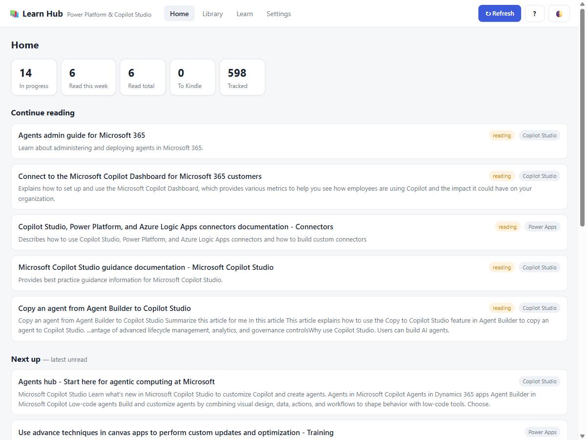
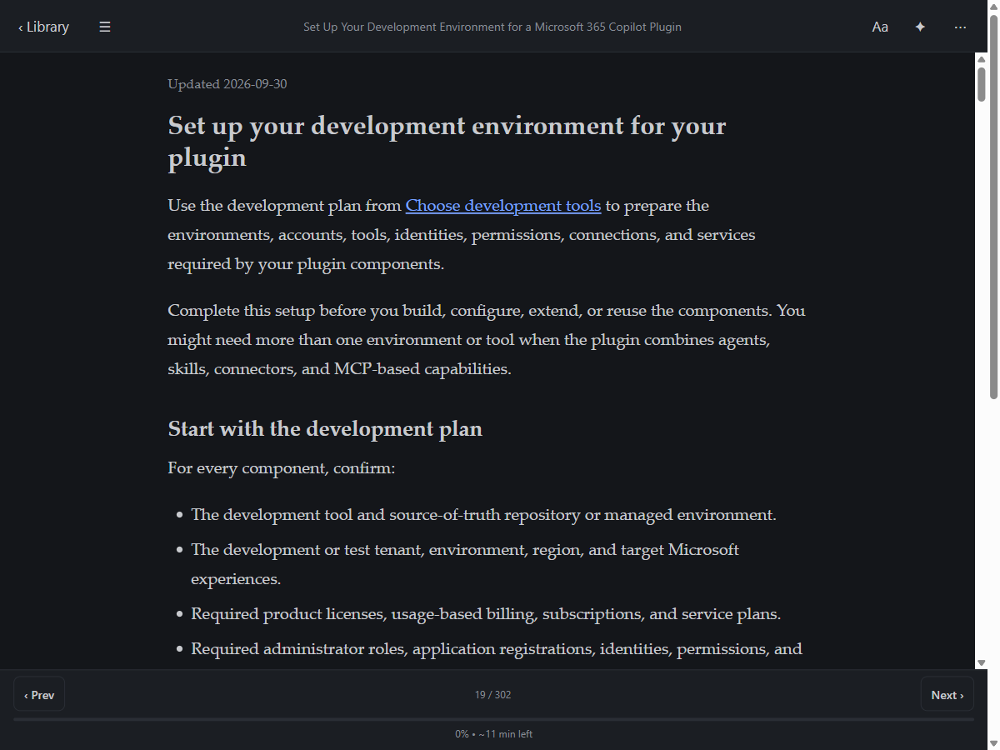
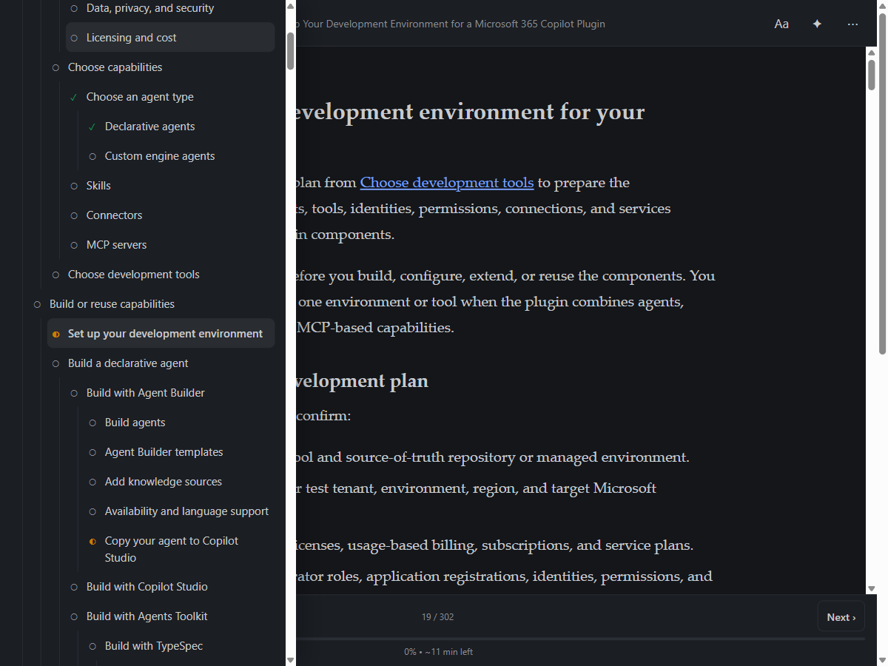
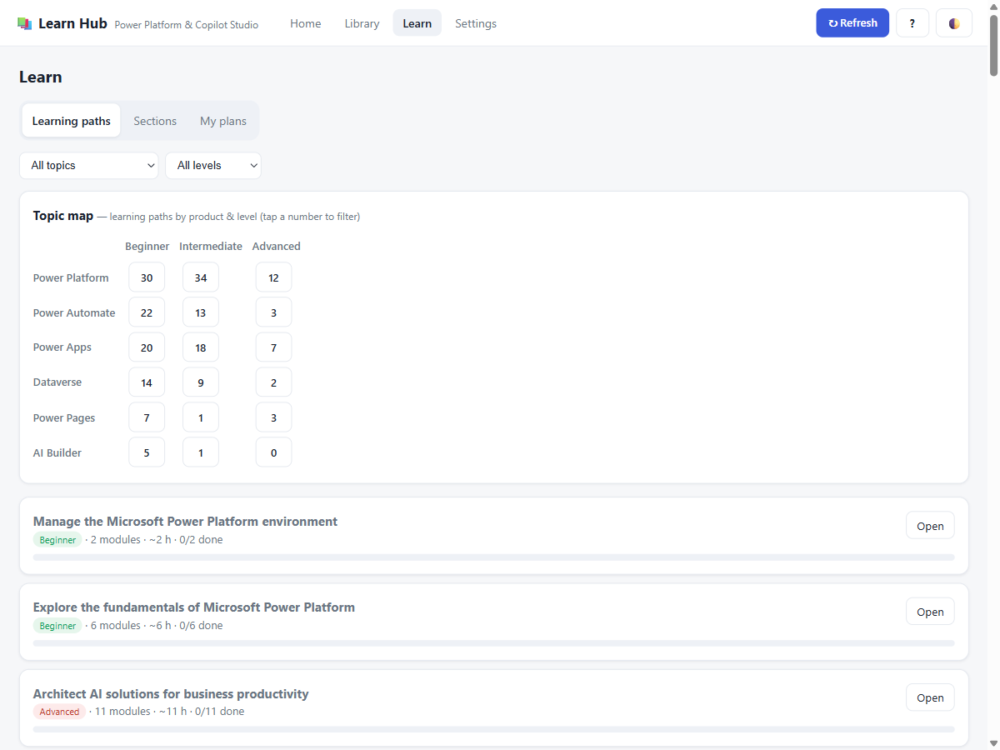

# 📚 Learn Hub

**A personal, offline-first reading platform for Microsoft Learn — focused on Power Platform & Copilot Studio.**

Learn Hub turns the sprawling Microsoft Learn docs into a calm, Kindle-style reading app that
runs entirely on your own machine. Browse and search articles, read them in a distraction-free
reader, **track what you've read**, get **summaries**, follow links **without leaving the app**,
walk through an **entire documentation section** with a table-of-contents, and get a **daily
notification** when new articles are published.

Built with **zero npm dependencies** — just Node.js. Nothing to compile, no accounts, no cloud.
Your data never leaves your computer.

> ⚠️ **Alpha.** This is an early, personal project shared in the hope it's useful. Expect rough
> edges, and extraction/UX may change. Feedback and issues are very welcome.

> Not affiliated with or endorsed by Microsoft. "Microsoft", "Power Platform", and "Copilot
> Studio" are trademarks of Microsoft. This app reads publicly available Microsoft Learn content.

---

## ✨ Features

| | |
|---|---|
| 📖 **Distraction-free reader** | Light / Sepia / Night themes, adjustable text size, spacing, width & typeface. Tap to go full-screen. Progress bar with “% · min left”. |
| ✅ **Reading tracking** | Mark articles Reading / Read, star-rate, and take notes. Progress shows on the Dashboard. |
| 🗺️ **Section navigation** | Scan a whole Learn docset (e.g. Copilot Studio *guidance*) into its table-of-contents, read & track every article, with a **Contents drawer (☰)** and **Prev/Next** paging inside the reader. |
| 🔗 **In-app links** | Links inside an article open in the reader (and get added to your Library) instead of bouncing to the website. |
| ✦ **Summaries** | Instant local summaries for free; higher-quality **Claude AI** summaries when you add an Anthropic API key. |
| 🆕 **What’s New** | Detects newly published / updated articles since your last visit. |
| 🎓 **Guided learning** | Microsoft **Learning Paths** (official, ordered by topic & skill level), a **topic map** showing how products and levels relate, and your own **reading plans** — all step-through with progress tracking. |
| 📩 **Send to Kindle** | Turn any article into an EPUB — save the file or email it to your Kindle. |
| 🔄 **Daily auto-refresh** | Optional Windows scheduled task that checks for new articles and shows a desktop notification. |
| 🗂️ **Custom topics** | Track exactly the products/queries you care about. |
| 📘 **In-app Guide** | A built-in Guide tab with instructions, a feature tour, and a roadmap. |

---

## 🖼️ Screenshots

| Dashboard | Reader (Night) | Section navigation |
|---|---|---|
|  |  |  |

**Guided learning** — Learning Paths, a topic map, and reading plans:



---

## ✅ Requirements

- **Node.js 22.14 or newer** (uses the built-in `node:sqlite` and `fetch` — no external packages).
  Check with `node --version`.
- Windows, macOS, or Linux. (The one-click launcher, scheduler, and desktop notifications are
  Windows-only; the app itself runs anywhere Node does.)

---

## 🚀 Quick start

**Windows** — double-click **`start.cmd`**.

**Any OS** — from a terminal:

```bash
cd learn-hub
npm start
```

It starts a tiny local server and opens `http://localhost:7777` in your browser. The first launch
automatically pulls the latest articles from Microsoft Learn. Everything is stored locally in
`data/learnhub.db`.

To stop it, close the terminal window (or press `Ctrl+C`).

---

## 📑 How to use it

The app has four areas — **Home · Library · Learn · Settings** — plus a **?** help icon.

1. **Refresh** — click **↻ Refresh** (top-right) to pull the latest. (First launch does this for you.)
2. **Pick something to read** — **Home** shows *Continue reading* and *Next up*; the **Library** lets
   you filter (All / Unread / Reading / Read / ✨ New) by topic and search.
3. **Read** — in the reader, tap **Aa** to choose a theme and tune the text. The bars auto-hide as
   you scroll down and return when you scroll up or reach the end (where a **✓ Mark as read** button
   waits). Tap **⋯** to mark Reading/Read, rate, add notes, send to Kindle, or add to a plan.
   Tap **✦** for a summary.
4. **Follow links** — tapping a Microsoft Learn link inside an article opens it in the reader and
   adds it to your Library; **‹ Back** steps back through what you followed.
5. **Guided learning** — the **Learn** tab has three sub-tabs:
   - **Learning paths** — official Microsoft paths by topic & level, plus a topic map. Open one and
     step through its modules with **Prev / Next**.
   - **Sections** — paste a docset URL (e.g.
     `https://learn.microsoft.com/en-us/microsoft-copilot-studio/guidance/`) to build its full
     navigation tree; read it with the reader's **☰** contents drawer and Prev/Next.
   - **My plans** — your own ordered reading lists (add articles from the reader's **⋯** menu).

   **Build a guide from any page** — when you open an overview/TOC article, the reader offers
   **"Build a guide ›"**, turning its links into an ordered plan you step through with Prev/Next.
6. **Stay current** — **Library → ✨ New** shows anything added since your last visit.

The **?** help icon opens the in-app **Guide** with all of this and your live setup status.

---

## 🤖 AI summaries (optional)

Local summaries work out of the box. For higher-quality summaries, add an **Anthropic API key**:

- **Settings → AI summaries → paste your key**, or set the `ANTHROPIC_API_KEY` environment variable.
- Default model is `claude-opus-4-8` (changeable in Settings). For cheap, fast summaries switch the
  model to `claude-haiku-4-5`. You pay Anthropic per use; the app falls back to local summaries if
  the key is missing or a call fails.

Your key is stored locally in `data/learnhub.db` — it is **never committed** (see `.gitignore`).

---

## 📩 Send to Kindle (optional)

Every article can become an EPUB. In **Settings → Send to Kindle** choose:

- **Save EPUB file** (default, no setup) → writes to `~/LearnHub-Kindle/`. Drop the file into
  Amazon’s official *Send to Kindle* app or browser extension.
- **Email to Kindle** → enter your `@kindle.com` address and SMTP details (e.g. Gmail + an app
  password). The app emails the EPUB directly. Your sending address must be on Amazon’s
  **Approved Personal Document Email List**, or delivery will bounce.

> The app can record *that* you sent an article to Kindle, but it cannot read your reading position
> **on the device** — Amazon exposes no API for that.

---

## 🔄 Daily auto-refresh & notifications (Windows)

Have Learn Hub check for new articles on its own and notify you on the desktop:

- Double-click **`setup-schedule.cmd`** → creates a Scheduled Task that runs each morning at 8:00 AM.
- Change the time: `setup-schedule.cmd 07:30`. Remove it: `remove-schedule.cmd`.
- It runs `notify-refresh.js` independently of the web app (shared database) and logs to `data/refresh.log`.

On **macOS/Linux**, point `cron` at `node notify-refresh.js` instead.

---

## ⚙️ Configuration (environment variables)

| Variable | Default | Purpose |
|---|---|---|
| `LEARNHUB_PORT` | `7777` | Server port |
| `LEARNHUB_HOST` | `127.0.0.1` | Bind address. Localhost-only by default; set `0.0.0.0` to read from another device on your network (see Security). |
| `LEARNHUB_EXPORT_DIR` | `~/LearnHub-Kindle` | Where EPUB files are saved |
| `ANTHROPIC_API_KEY` | – | Enables AI summaries |

---

## 🔐 Data & privacy

- **Everything is local.** Articles, reading history, notes, and settings live in `data/learnhub.db`
  on your machine. Nothing is sent anywhere except: requests to `learn.microsoft.com` (to fetch
  content) and, if you enable them, Anthropic (summaries) and your SMTP server (Kindle email).
- **Secrets** (Anthropic key, SMTP password) are stored in the local database. The provided
  `.gitignore` excludes `data/` so they’re never committed — **keep it that way**.
- **Security hardening for sharing:** the server binds to **localhost only** by default, and all
  server-side fetches are **restricted to `learn.microsoft.com`** (so the app can’t be used as an
  open proxy). Only change `LEARNHUB_HOST` if you understand the implications.

---

## 🗂️ Project structure

```
learn-hub/
├─ server.js            # Local HTTP server + JSON API (Node built-ins only)
├─ notify-refresh.js    # Background refresh + Windows desktop notification
├─ src/
│  ├─ config.js         # Ports, paths, topics, URL allow-list
│  ├─ db.js             # node:sqlite schema + helpers
│  ├─ learn.js          # Learn RSS + catalog + article extraction
│  ├─ refresh.js        # Shared refresh logic (server + scheduler)
│  ├─ toc.js            # Docset table-of-contents builder (with cache)
│  ├─ summarize.js      # Local extractive + optional Claude summaries
│  └─ kindle.js         # EPUB builder + file export + minimal SMTP client
├─ public/              # Vanilla-JS single-page app (index.html, app.js, styles.css)
├─ start.cmd            # Windows launcher
├─ setup-schedule.cmd   # Install daily refresh task
└─ remove-schedule.cmd  # Remove it
```

## 🛠️ How it works

- **Articles & updates** come from the Microsoft Learn **search RSS** feed
  (`/api/search/rss`) — works for any topic, including Copilot Studio.
- **Training** comes from the Microsoft Learn **Catalog API** (`/api/catalog`).
- **Section navigation** reads each docset’s **`toc.json`** (the same data that builds Learn’s left nav).
- **Reading** fetches the article page and extracts the main content (Learn blocks iframes, so the
  server proxies and cleans it). “Open on Learn” is always available as a fallback.
- **Storage** is the built-in `node:sqlite`; the UI is dependency-free vanilla JS.

---

## 🗺️ Roadmap

See the **Guide** tab in the app for live status. In short:

- **Done** — Kindle-style reader (themes/typography/immersive); in-app links → Library;
  section navigation (TOC drawer + Prev/Next) with progress; **guided learning (Learning Paths,
  topic map, reading plans)**; local + AI summaries; daily auto-refresh with notifications.
- **Planned** — resume reading where you left off; keyboard ←/→ and edge-swipe paging;
  a pinned “Saved / linked” shortcut.
- **Ideas** — full-text search across article bodies; highlights & annotations; offline caching;
  corporate proxy support; reading goals & streaks.

---

## 🤝 Contributing

Issues and PRs welcome. It’s intentionally **dependency-free** — please keep new features to Node
built-ins and vanilla JS where practical. There’s no build step: edit, run `npm start`, hard-refresh.

---

## 🤖 Built with Claude

Learn Hub was built iteratively with **Claude** (via Claude Code) — from the first idea ("a personal
learning platform for Microsoft Learn") through the reader, tracking, guided learning, and Kindle
export. It's an experiment in building a genuinely useful, zero-dependency app this way. The code is
plain Node.js and vanilla JS so it stays easy to read, fork, and understand.

---

## 📄 License

[MIT](LICENSE) © Lou Rainaldi
